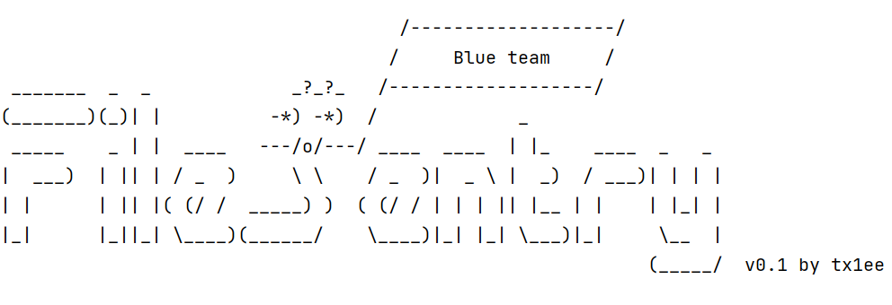
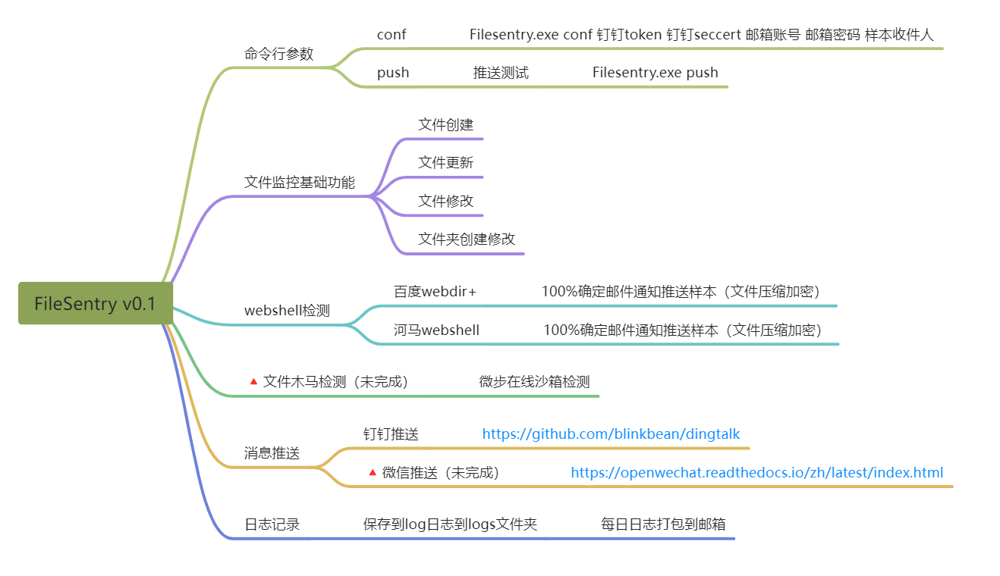
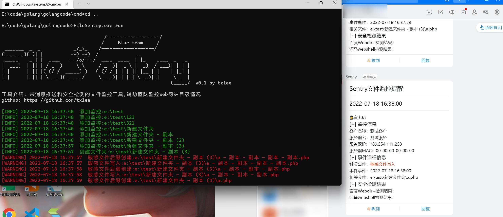
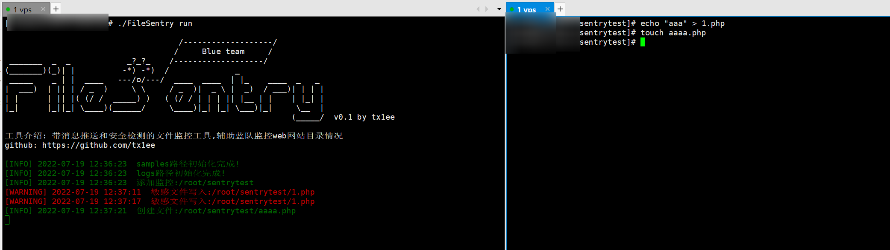

### FileSentry v0.1 https://github.com/tx1ee/FileSentry


## 开发背景

工具开发想法最早是去年国hvv，客户那边云上资产linux服务器比较多，d盾可以监控windows上的文件变化但是没有linux版本，github上也有一些用python开发的文件监控工具，但是每次跑到服务器上看觉得有点麻烦，后面想法就是写个多平台带消息推送和安全检测的工具，在去年的7月份用python开发了一个版本用pyinstall编译exe或linux可执行文件，效果如下：


## 工具简介



对网站目录进行监控，监控对web目录敏感后缀，钉钉机器人推送消息通知，web脚本安全检测，调用了百度webdir+、河马webshell在线检测平台对网站脚本检测(检测效果一般)，师傅们有推荐的在线检测平台可以交流一下。

## 主要功能

整个工具的功能结构，红色标记的是未完成部分。



## 运行环境

FileSentry用golang编写，文件监控功能用的fsnotify库，fsnotify库api支持常见操作系统，FileSentry可以多个平台编译使用，测试windows\linux amd64正常运行监控。

fsnotify：https://github.com/fsnotify/fsnotify

## 运行截图

windows运行截图



linux运行截图



## usege

#### 程序初始化配置

```
Filesentry.exe conf 钉钉token 钉钉seccert 邮箱账号 邮箱密码 样本收件人
```

#### 启动监控

```
FileSentry.exe run
```

#### 消息推送测试

```
FileSentry.exe push
```

#### 配置文件详解

```yaml
User: 测试客户
ServerName: 测试服务
ServerIP: 169.254.111.253 # 程序初始化自动获取
ServerMac: 00-00-00-00-00-00 # mac地址
PushConf:
  DingToken: you dingding token # 钉钉token
  DingSecert: you dingding secret # 钉钉secert
  MailUser: you mail account # 邮箱账号
  MailKey: you mail password # 邮箱密码
  Mailaddr: Email notification recipient # 样本推送接受邮箱
  SecCheck: true # 是否开启安全检测
  Mailpush: true # 是否开启文件监控
Bfilesuffix: # 监控告警后缀
- .php
- .exe
- .php3
MonitorDirs: # 监控目录 子目录也会添加到监控路径
- c:\
ExcludeDirs: # 排除目录
- c:\tx1ee\test
```


